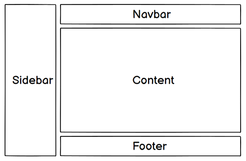
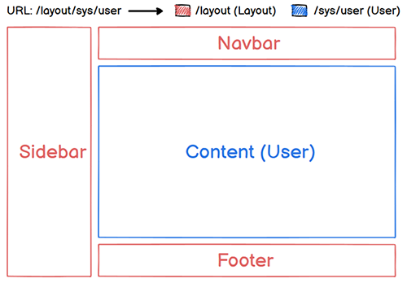

[TOC]

# 路由初试

## 🎯 目标

- 实现嵌套路由，路由跳转时只重新渲染子路由指向的视图。
- 实现访问 `/` （根路径）显示的是 `/home` （后台首页）。

## 😴 功课

实际生活中的应用界面，通常由多层嵌套的组件组合而成。例如后台管理系统 `layout` （布局）一般由 navbar、sidebar、content、footer 组成，布局示意图如下：



除了 content 外，其它三个区域的内容一般不会变动，在这种情况下，可以使用`嵌套路由`，将 content 设为嵌套路由中的子路由，即路由视图出口。这样每次路由变化只会重新渲染 content 。

下面是请求“后台首页”和“用户管理页”的示意图：




> 💡 改变 URL 的片段通常对应于特定的嵌套组件结构，URL 中的 `/sys` 片段根据业务需要也可以指定嵌套组件。

## 🍸 准备

### 调整文件&目录

在 `src` 目录下创建 `router` 文件夹，用来存放路由文件。

router文件目录结构如下：

📁 src

----📁 router

--------📄 index.ts

<br/>

在 `/src/components` 目录下创建 `layout` 文件夹，用来存放布局组件。

components文件目录结构如下：

📁 src

----📁 components

--------📁 layout

------------📄 index.vue

--------📁 demos

------------📄 Env.vue

------------📄 Router.vue

> 💡 Env.vue 由 HelloWorld.vue 重命名。demos 目录下放的是学习过程中的组件。

<br/>

在 `src` 目录下创建 `views` 文件夹，用来存放路由指向的视图文件，通俗的讲就是页面。

views文件目录结构如下：

----📁 views

--------📁 sys

------------📄 User.vue

--------📄 Home.vue

--------📄 Login.vue

## 🌈 Coding

### 创建路由

在 `router/index.ts` 中创建路由对象，根路由添加 `redirect` 属性，将请求重定向到 /home，/home添加别名 `alias`，在地址栏显示 /。代码如下：

```typescript
import { createRouter, createWebHashHistory } from 'vue-router'

// ↓定义路由
const routes = [
  // ↓layout父路由
  {
    // ↓路由地址
    path: '/',
    // ↓路由名称（唯一值），在路由跳转时能用到
    name: '',
    // ↓路由渲染组件
    component: () => import('@/components/layout/index.vue'),
    // ↓重定向
    redirect: { name: 'home' },
    // ↓子路由
    children: [
      // ↓首页
      {
        path: '/home',
        name: 'home',
	      // ↓路由别名
  			alias: '/',
        component: () => import('@/views/Home.vue')
      },
      // ↓用户管理
      {
        path: '/sys/user',
        name: 'sys-user',
        component: () => import('@/views/sys/User.vue')
      },
    ]
  },
  // ↓登录页
  {
    path: '/login',
    name: 'login',
    component: () => import('@/views/Login.vue')
  },
]

// ↓创建路由实例并传递routes
const router = createRouter({
  // ↓router内部提供了history模式的实现，使用hash模式
  history: createWebHashHistory(),
  routes,
})

export default router
```

> 💡 login 的布局和其它页面不相同，所以不要嵌套到 layout 路由中。

### 使用路由

在 main.ts 使用路由：

```typescript
import { createApp } from 'vue'
import App from './App.vue'
import router from './router/index'

createApp(App).use(router).mount('#app')
```

### 总路由视图

在 `App.vue` 中添加 `router-view` ，同时删除其它页面内容：

```vue
<template>
  <!-- ↓总路由视图 -->
  <router-view></router-view>
</template>

<script lang="ts">
import { defineComponent } from "vue";

export default defineComponent({
  name: "App",
});
</script>
```

### Login页面

Login 为非嵌套页面，用来做对比，代码如下：

```vue
<template>
  <h2>Login Page</h2>
  <router-link to="/">Go to Home</router-link>
</template>

<script lang="ts">
import { defineComponent } from "vue";

export default defineComponent({
  name: "Login",
});
</script>

```

### Layout路由视图

在 `components/layout/index.vue` 中加入 `router-view` 。代码如下：

```vue
<template>
  <h2 class="red">固定区域</h2>
  <!-- ↓layout路由视图 -->
  <router-view></router-view>
</template>

<script>
import '@/styles/index.scss'
import { defineComponent } from "vue";

export default defineComponent({
  name: "Layout",
});
</script>
```

> “固定区域” 代表布局中的 navbar、sidebar、footer。

### 嵌套页面

路由配置中的视图页面是 Home.vue 和 User.vue。将 Env.vue 和 Router.vue 导入 Home.vue。`Home.vue` 代码如下：

```vue
<template>
  <Env />
  <Router />
</template>

<script lang="ts">
import { defineComponent } from "vue";
import Env from "@/components/demos/Env.vue";
import Router from "@/components/demos/Router.vue";

export default defineComponent({
  name: "Home",
  components: {
    Router,
    Env,
  },
});
</script>
```

<br/>

`User.vue` 代码如下：

```vue
<template>
  <h2>User Page</h2>
  <router-link to="/">Go to Home</router-link>
</template>

<script lang="ts">
import { defineComponent } from "vue";

export default defineComponent({
  name: "User",
});
</script>
```

### Demo组件

demo组件是 Env.vue 和 Router.vue。Env.vue 就是之前的 HelloWorld.vue 改了一点点：修改了name，去掉了 red 样式。`Env.vue` 不贴代码了。

`Router.vue` 用来测试路由跳转，代码如下：

```vue
<template>
  <!-- ↓路由demo -->
  <div>
    <h2>路由</h2>
    <!-- ↓匹配路由path进行跳转 -->
    <router-link to="/sys/user">Go to User</router-link> <br />
    <!-- ↓匹配路由name进行跳转 -->
    <router-link :to="{ name: 'login' }">Go to Login</router-link>
  </div>
</template>

<script lang="ts">
import { defineComponent } from "vue";

export default defineComponent({
  name: "Router",
});
</script>
```

## 🎭 结果

- 浏览器访问 `/` 显示 `/home` 页面内容，但地址栏显示 `/` 。
- 在 /home 和 /sys/user 之间跳转，子组件重新渲染，layout 父组件不变。
- 访问 /login 跳出 layout 组件。