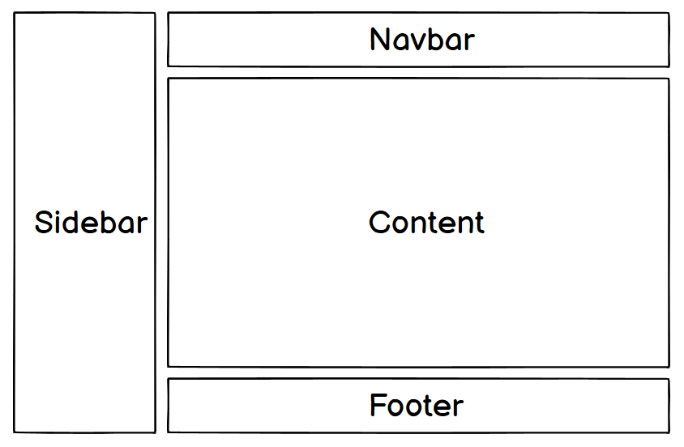
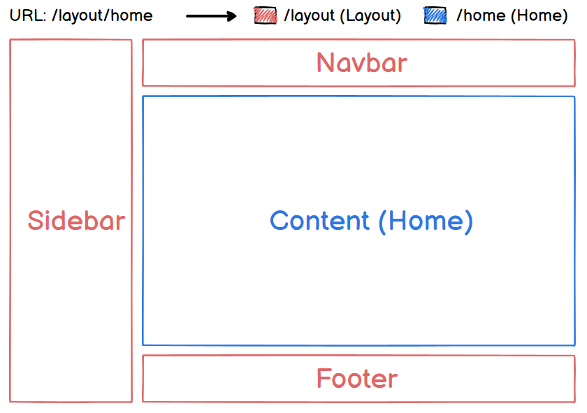
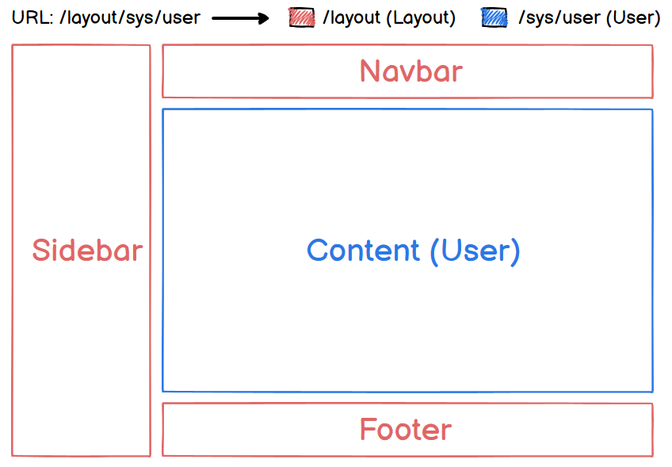

# 嵌套路由（1）

## 应用场景

实际生活中的应用界面，通常由多层嵌套的组件组合而成。例如后台管理系统 `layout` （布局）一般由 navbar、sidebar、content、footer 组成，布局示意图如下：



除了 content 外，其它三个区域的内容一般不会变动，在这种情况下，可以将 content 设为嵌套路由中的子路由，即路由出口，其它三个区域渲染到父路由。这样每次路由变化只会重新渲染 content 。例如下面请求“后台首页”和“用户管理页”的示意图：





> 改变URL 的片段通常对应于特定的嵌套组件结构，URL 中的 `/sys` 片段根据业务需要也可以指定嵌套组件。

## 🌈Coding

### 路由配置

- 通过嵌套路由来表达上诉应用场景的关系， 修改`router/index.ts` 中路由定义为嵌套关系。
- 通常用户登录以后，我们如果再直接访问 `/` （根路径）就是 `/home` （后台首页）。所以将父路由再完善下，添加 `redirect` 属性，访问 / 时将请求重定向到 /home。

修改后的文件内容如下：

```typescript
import { createRouter, createWebHashHistory } from 'vue-router'

// ↓定义路由
const routes = [
  // ↓layout父路由
  {
    // ↓路由地址
    path: '/',
    // ↓路由名称（唯一值），在路由跳转时能用到
    name: '',
    // ↓路由渲染组件
    component: () => import('@/components/layout/index.vue'),
    // ↓重定向
    redirect: { name: 'home' },
    // ↓子路由
    children: [
      // ↓首页
      {
        path: '/home',
        name: 'home',
        component: () => import('@/views/Home.vue')
      },
      // ↓用户管理
      {
        path: '/sys/user',
        name: 'sys-user',
        component: () => import('@/views/sys/User.vue')
      },
    ]
  },
  // ↓登录页
  {
    path: '/login',
    name: 'login',
    component: () => import('@/views/Login.vue')
  },
]

// ↓创建路由实例并传递routes
const router = createRouter({
  // ↓router内部提供了history模式的实现，使用hash模式
  history: createWebHashHistory(),
  routes,
})

export default router
```

> 登录页 /login 的布局和其它页面不相同，所以不需要嵌套到 layout 路由中。

### 调整文件目录结构

根据路由配置文件中的内容，对应调整下文件目录结构。

调整后的主要文件目录结构如下：

📁 src

----📁 components

--------📁 layout

------------📄 index.vue

--------📄 Study.vue

----📁 router

--------📄 index.vue

----📁 styles

--------📁 common

------------📄 font.scss

--------📄 index.scss

----📁 views

--------📁 sys

------------📄 User.vue

--------📄 Home.vue

--------📄 Login.vue

----📄 App.vue

----📄 main.ts

### 收尾

Layout已作为嵌套路由的父路由，所以需要在Layout中加入 `router-view` ，以渲染子路由匹配的视图。在 `components/layout/index.vue` 输入如下内容：

```vue
<template>
  <!-- ↓layout下的路由出口 -->
  <router-view></router-view>
</template>
```

根据文章开头的布局设计，Layout已经将整个页面铺满，并且我们不需要在布局外再显示额外内容。所以 App.vue 中除了 router-view 不能在有其它页面元素，故将引入 Study 的内容删除，删除后 `App.vue` 中的内容如下：

```vue
<template>
  <!-- ↓顶级路由出口 -->
  <router-view></router-view>
</template>

<script lang="ts">
import { defineComponent } from 'vue'

export default defineComponent({
  name: 'App',
})
</script>
```

> 至此，访问根路径已能顺利跳转到Home页面。但嵌套路由的效果还不能直观感受到，下一章将继续讲解。