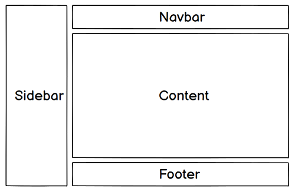
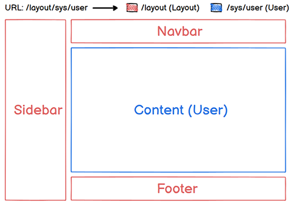

# 嵌套路由

## 😴 功课

实际生活中的应用界面，通常由多层嵌套的组件组合而成。例如后台管理系统 `layout` （布局）一般由 navbar、sidebar、content、footer 组成，布局示意图如下：



除了 content 外，其它三个区域的内容一般不会变动，在这种情况下，可以将 content 设为嵌套路由中的子路由，即路由视图出口。这样每次路由变化只会重新渲染 content 。

下面是请求“后台首页”和“用户管理页”的示意图：




> 💡 改变 URL 的片段通常对应于特定的嵌套组件结构，URL 中的 `/sys` 片段根据业务需要也可以指定嵌套组件。

## 🎯 目标

- 根据“功课”中的应用场景实现嵌套路由，路由跳转时，Layout 中的 router-view 重新渲染子路由视图。
- 实现访问 `/` （根路径）显示的是 `/home` （后台首页）。

## 🍸 准备

在 `/src/components` 目录下创建 `layout` 文件夹，用来存放布局组件。

components文件目录结构如下：

📁 src

----📁 components

--------📁 layout

------------📄 index.vue

--------📄 HelloWorld.vue

<br/>

在 `/src/views` 目录下创建 `sys` 文件夹，用来存放"系统管理"视图。

views文件目录结构如下：

----📁 views

--------📁 sys

------------📄 User.vue

--------📄 Home.vue

--------📄 Login.vue

## 🌈 Coding

修改路由为嵌套关系。添加 `redirect` 属性，访问 / 时将请求重定向到 /home。`router/index.ts` 修改后代码如下：

```typescript
......
// ↓定义路由
const routes = [
  // ↓layout父路由
  {
    // ↓路由地址
    path: '/',
    // ↓路由名称（唯一值），在路由跳转时能用到
    name: '',
    // ↓路由渲染组件
    component: () => import('@/components/layout/index.vue'),
    // ↓重定向
    redirect: { name: 'home' },
    // ↓子路由
    children: [
      // ↓首页
      {
        path: '/home',
        name: 'home',
        component: () => import('@/views/Home.vue')
      },
      // ↓用户管理
      {
        path: '/sys/user',
        name: 'sys-user',
        component: () => import('@/views/sys/User.vue')
      },
    ]
  },
  // ↓登录页
  {
    path: '/login',
    name: 'login',
    component: () => import('@/views/Login.vue')
  },
]
......
```

> 💡 login 的布局和其它页面不相同，所以不要嵌套到 layout 路由中。

<br/>

在 `components/layout/index.vue` 中加入 `router-view` ，以渲染子路由的视图。代码如下：

```vue
<template>
	<h2>Layout Fixed</h2>
  <!-- ↓layout路由视图 -->
  <router-view></router-view>
</template>
```

<br/>

`User.vue` 是子路由视图，代码如下：

```vue
<template>
  <h2>User Page</h2>
  <!-- ↓跳转到根路径 -->
  <router-link to="/">Go to Home</router-link>
</template>
```

<br/>

`Home.vue` 是子路由视图，且是后台首页。为了方便测试，将 HelloWorld.vue 中的代码复制过来，需要修改下name属性。再将 <u>Go to Home</u> 改成 <u>Go to User</u> 。修改代码如下：

```vue
......
<!-- ↓匹配路由path进行跳转 -->
<router-link to="/sys/user">Go to User</router-link> <br />
......
export default defineComponent({
	name: "Home",
......
```

> 💡 如果你愿意，可以让HelloWorld.vue下岗了。

<br/>

布局的固定内容仅在 layout/index.vue 实现即可，将 `App.vue` 中除 router-view 外的内容删除。删除后的代码如下：

```vue
<template>
  <!-- ↓总路由视图 -->
  <router-view></router-view>
</template>

<script lang="ts">
import { defineComponent } from 'vue'

export default defineComponent({
  name: 'App',
})
</script>
```

## 🎭 结果

- 访问 / 跳转到 /home。
- 在 /home 和 /sys/user 之间跳转，Layout内容不变。